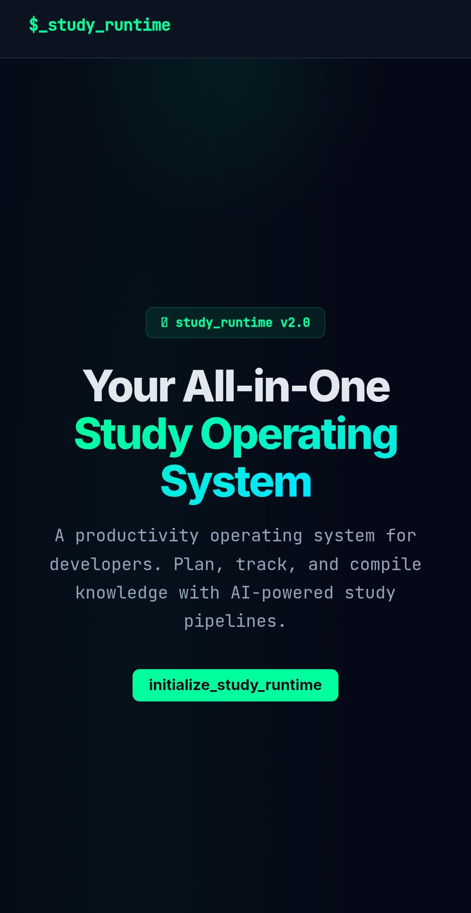
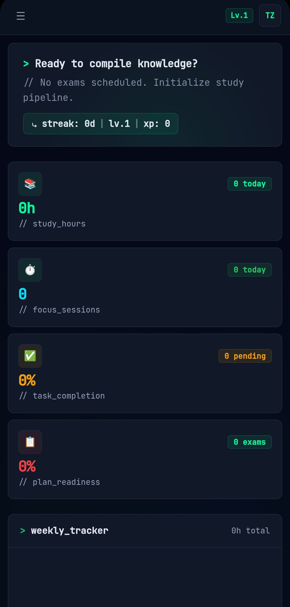
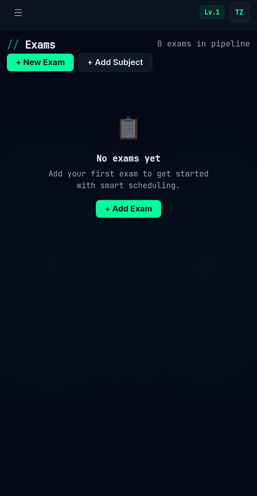
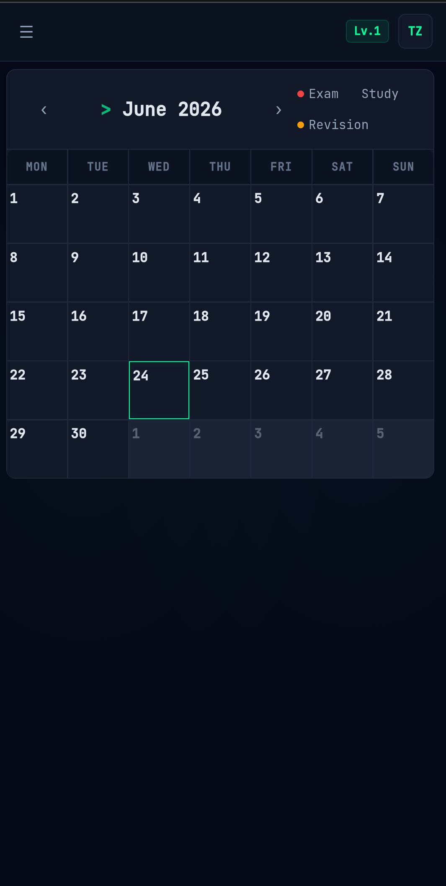
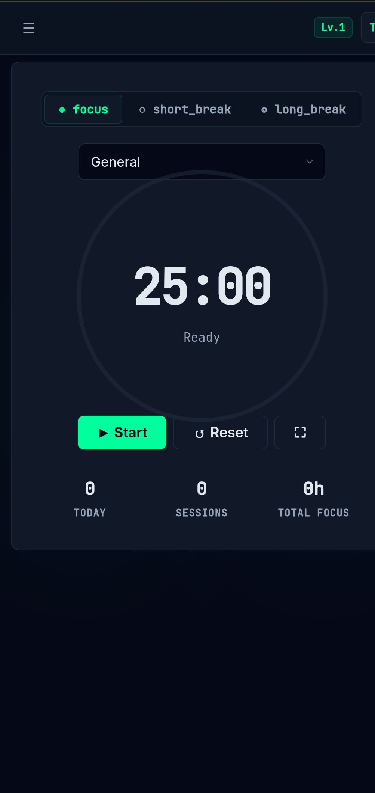
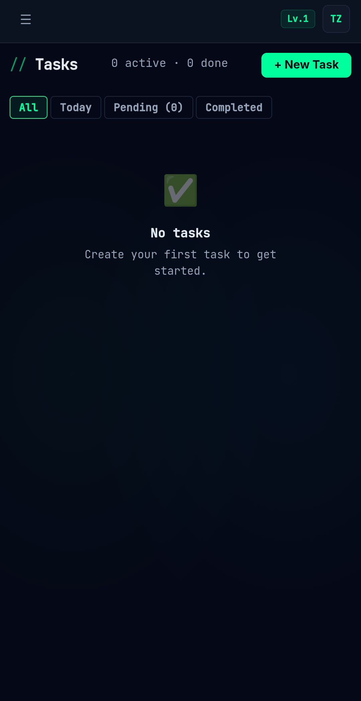
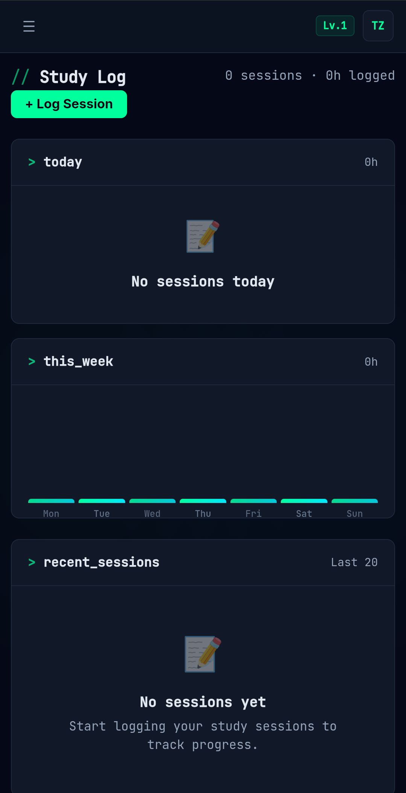
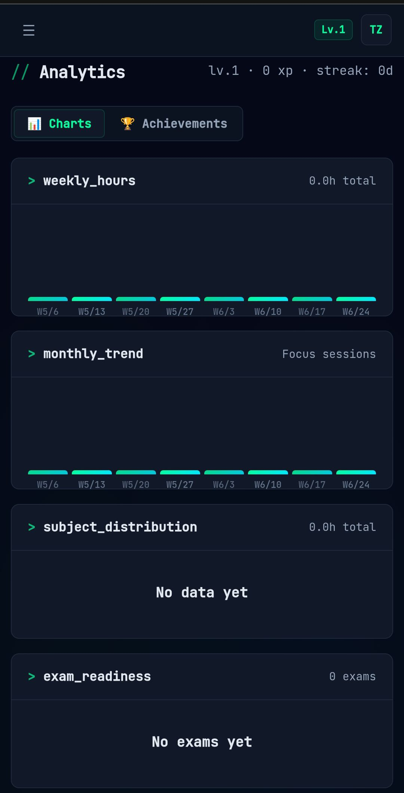

# $_ study_runtime

A developer-themed productivity operating system for exam preparation. Plan, track, and compile knowledge with an interactive study pipeline.

  

## Features

### 📊 Dashboard
System monitor for study metrics, weekly hours, and exam queue. Get a bird's-eye view of your entire study pipeline.

  

### 📝 Exam Manager
Track exams with syllabus progress meters and priority flags. Keep tabs on upcoming tests and completion status.

  

### 📅 Calendar
Sprint-style calendar for exams, study blocks, and revision sessions. Visualize your schedule at a glance.

  

### 🎯 Focus Engine
Pomodoro-based concentration timer with terminal aesthetic. Stay in the flow with timed study sessions.

  

### 📋 Task Pipeline
Organize tasks with priority sorting, due dates, and recurring jobs. Manage your to-do list like a dev backlog.

  

### 📓 Study Logger
Log sessions with productivity metrics and mood tracking. Keep a detailed record of every study session.

  

### 📈 Analytics Engine
Performance metrics with chart visualizations and readiness scores. Track your progress with data-driven insights.

  

### More Features
- **Schedule Generator** — AI engine that builds optimized study timelines based on difficulty
- **Knowledge Base** — Notes system with tags, search indexing, and pinning
- **Achievements** — Unlock badges for streaks, study hours, and task completions
- **XP System** — Level progression with experience points and streak tracking

## Tech Stack

- **React 18** + **TypeScript**
- **date-fns** — Date utilities
- **CSS** — Dark-first design system with progressive responsive breakpoints
- **LocalStorage** — Client-side persistence
- **Vite** — Build tooling

## Responsive Breakpoints

| Breakpoint | Target |
|---|---|
| 320px–639px | Mobile S |
| 640px–767px | Mobile L |
| 768px–1023px | Tablet |
| 1024px–1279px | Laptop |
| 1280px–1535px | Desktop |
| 1536px–1919px | Desktop HD |
| 1920px–2559px | Ultrawide |
| 2560px+ | 4K |

## Author

**Tabiq Zargar**
Email: zargartabiq@gmail.com
